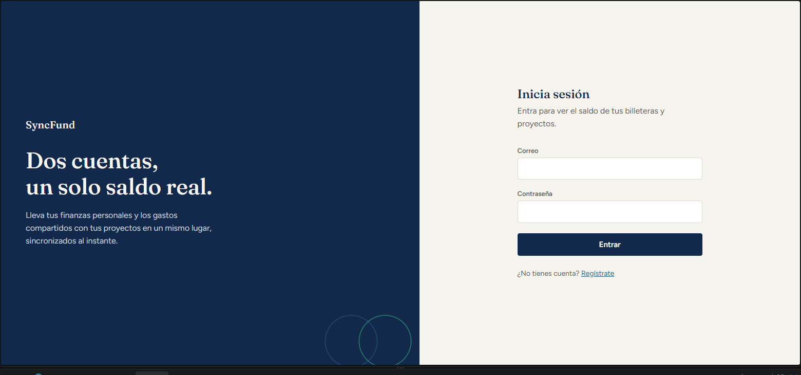
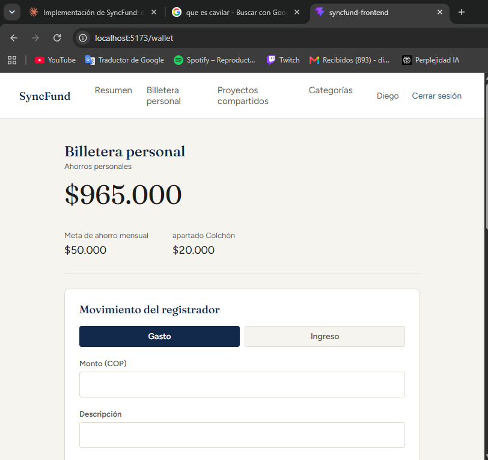
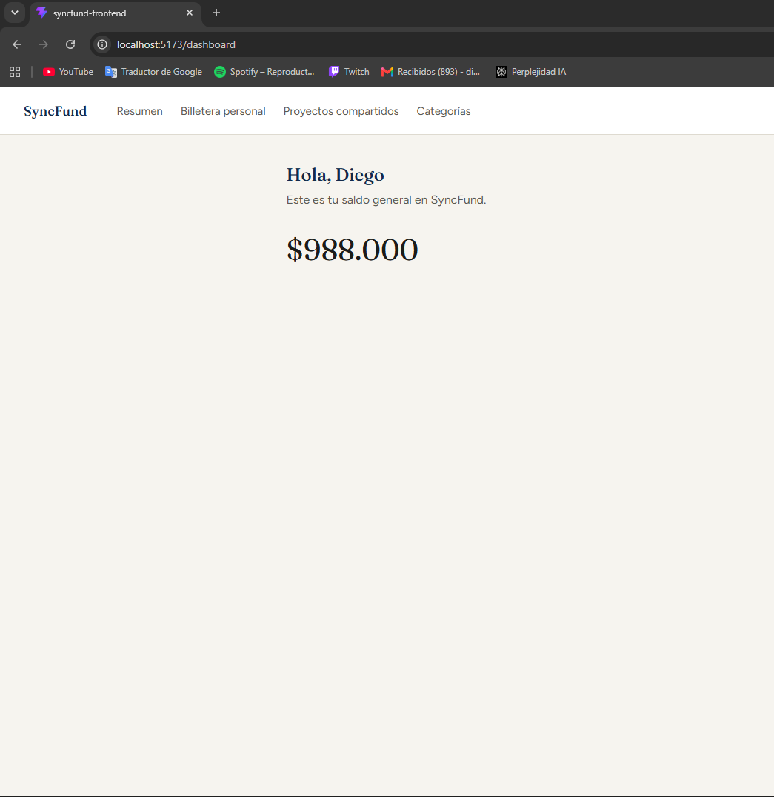

# SyncFund

**Finanzas personales y gastos compartidos, sincronizados en tiempo real.**

SyncFund es una aplicación web para llevar tus finanzas personales y, al mismo tiempo, coordinar gastos compartidos con otras personas (un apartamento, un viaje, un proyecto grupal) sin perder de vista quién debe qué. Proyecto académico desarrollado para la asignatura de Construcción de Software, Politécnico Colombiano Jaime Isaza Cadavid.

🔗 **Demo en producción:** [syncfund.vercel.app](https://syncfund.vercel.app)

---

## Tabla de contenidos

- [Descripción](#descripción)
- [Ejemplos del proyecto](#ejemplos-del-proyecto)
- [Características principales](#características-principales)
- [Instalación y ejecución](#instalación-y-ejecución)
- [Construido con](#construido-con)
- [Recursos útiles](#recursos-útiles)
- [Colaboradores](#colaboradores)

---

## Descripción

Administrar el dinero propio ya es difícil; hacerlo en grupo (arriendo, mercado, un viaje entre amigos) añade una capa extra: alguien paga, los demás quedan debiendo, y casi nunca queda claro cuánto ni a quién. SyncFund nace para resolver ese problema concreto, combinando dos cosas que normalmente viven en aplicaciones separadas:

- Una **billetera personal**, con metas de ahorro y un "colchón" de seguridad que no se puede dejar en negativo.
- **Proyectos compartidos**, donde cada gasto se reparte automáticamente entre los involucrados — tanto en el fondo del grupo como en la billetera personal de cada uno — y el sistema calcula en todo momento quién debe y a quién le deben.

El proyecto se construyó siguiendo un diseño orientado a objetos completo (diagrama de clases, CRC cards, patrón Observer, máquinas de estado) antes de escribir una sola línea de código, y se implementó como una arquitectura en capas real: backend en Spring Boot, frontend en React, base de datos MySQL, con autenticación JWT y autorización por recurso (nadie puede ver ni tocar los datos de otra persona, ni siquiera con un token válido propio).

Los principales retos durante el desarrollo fueron tres: mantener el patrón Observer fiel al diseño original mientras se traducía a una API REST sin estado; decidir cómo representar el "doble descuento" de un gasto compartido (del fondo del proyecto y de la billetera de cada involucrado) sin romper el cálculo de deudas; y cerrar la capa de autorización para que la autenticación JWT no se quedara a medias (saber *quién eres* sin verificar *qué te pertenece*).

De cara al futuro, queda pendiente implementar las máquinas de estado completas descritas en el diseño original (ciclo de vida de un proyecto compartido: Activo → En Liquidación → Cerrado) y mover la sincronización en tiempo real de "poll" (recargar datos) a un mecanismo push real con WebSockets.

## Ejemplos del proyecto

| Inicio de sesión | Billetera personal | Resumen general |
|---|---|---|
|  |  |  |

Puedes probar la aplicación en vivo, sin instalar nada, en **[syncfund.vercel.app](https://syncfund.vercel.app)**.

## Características principales

- **Billetera personal**: registro de ingresos y gastos, meta de ahorro mensual con cálculo automático de cuota, y un "colchón" de seguridad que nunca permite dejar el saldo en negativo.
- **Proyectos compartidos**: crea un grupo, agrega integrantes por correo electrónico, registra gastos selectivos (eliges quién participa en cada uno) y aportes al fondo común.
- **Cálculo de deudas en tiempo real**: en todo momento puedes ver si estás "en paz", te deben, o debes, sin tener que hacer la cuenta a mano.
- **Categorías con alerta de presupuesto**: define un límite mensual por categoría de gasto y recibe aviso visual cuando lo superas.
- **Seguridad real**: autenticación con JWT y una capa de autorización que verifica, en cada petición, que el recurso solicitado pertenezca a quien hace la petición — no solo que esté logueado.
- **Diseño propio**: sistema de diseño construido desde cero bajo el concepto "libro mayor, no dashboard" — líneas finas y alineación tabular de cifras en vez del típico dashboard de tarjetas con sombra.

## Instalación y ejecución

### Requisitos previos

- Java 21
- Node.js (LTS) y npm
- MySQL Server 8.0+
- Git

### 1. Clona el repositorio

```bash
git clone https://github.com/Gago82241/syncfund_.git
cd syncfund_
```

### 2. Backend (`demo/`)

Crea la base de datos y un usuario dedicado en tu MySQL local:

```sql
CREATE DATABASE IF NOT EXISTS syncfund_db;
CREATE USER IF NOT EXISTS 'syncfund_user'@'localhost' IDENTIFIED BY 'TU_CONTRASEÑA';
GRANT ALL PRIVILEGES ON syncfund_db.* TO 'syncfund_user'@'localhost';
```

Configura `demo/src/main/resources/application.properties` con tus credenciales (o usa las variables de entorno `DB_URL`, `DB_USERNAME`, `DB_PASSWORD`, `JWT_SECRET` — todas tienen un valor por defecto para desarrollo local).

```bash
cd demo
.\mvnw.cmd spring-boot:run      # Windows
./mvnw spring-boot:run          # macOS / Linux
```

El backend queda escuchando en `http://localhost:8080`. Hibernate crea las tablas automáticamente en el primer arranque.

### 3. Frontend (`syncfund-frontend/`)

```bash
cd syncfund-frontend
npm install
npm run dev
```

La aplicación queda disponible en `http://localhost:5173`, conectada por defecto a `http://localhost:8080/api`.

## Construido con

**Backend**
- [Spring Boot 4.1.1](https://spring.io/projects/spring-boot) (Java 21) — framework principal
- [Spring Data JPA](https://spring.io/projects/spring-data-jpa) + Hibernate — persistencia
- [Spring Security](https://spring.io/projects/spring-security) + [JJWT](https://github.com/jwtk/jjwt) — autenticación y autorización
- MySQL 8 — base de datos relacional
- Maven — gestor de dependencias

**Frontend**
- [React](https://react.dev/) + [TypeScript](https://www.typescriptlang.org/) — vía [Vite](https://vite.dev/)
- [React Router](https://reactrouter.com/) — enrutamiento
- [Axios](https://axios-http.com/) — cliente HTTP

**Arquitectura y patrones de diseño**
- Arquitectura en capas (Presentación / Aplicación / Dominio / Persistencia)
- Patrón **Observer** (`SharedProject` como sujeto observable, notifica cambios de saldo a sus participantes)
- Autenticación **JWT** sin estado + autorización por recurso (dueño/membresía, no solo "está logueado")

**Infraestructura**
- [Railway](https://railway.com/) — backend y base de datos MySQL en producción
- [Vercel](https://vercel.com/) — frontend en producción
- GitHub — control de versiones

```java
// Ejemplo: el patrón Observer en el dominio — SharedProject notifica
// a cada integrante cuando el estado financiero del grupo cambia.
public void registerSelectiveExpense(double amount, Long payerId,
                                      List<Long> involvedIdsList, String description) {
    this.currentBalance -= amount;
    notifyObservers(amount, description);
}
```

## Recursos útiles

- [Documentación oficial de Spring Boot](https://docs.spring.io/spring-boot/index.html)
- [Documentación oficial de React](https://react.dev/learn)
- [JJWT — librería JWT para Java](https://github.com/jwtk/jjwt)
- [Documentación de Railway](https://docs.railway.com/)
- [Documentación de Vercel](https://vercel.com/docs)
- [Refactoring Guru — patrón Observer](https://refactoring.guru/es/design-patterns/observer)

## Colaboradores

- **Diego Alejandro Pulgarin Gómez** — [@Gago82241](https://github.com/Gago82241)
- **Juan Jose Correa Londoño** — [@juancorrea82232-rgb](https://github.com/juancorrea82232-rgb)
- **Harold Arteaga** — [@HarArte](https://github.com/HarArte)
- **Yorleyner Mazo Cardenas** — [@yorleynermc](https://github.com/yorleynermc)

---

<p align="center">Proyecto académico · Politécnico Colombiano Jaime Isaza Cadavid · 2026</p>
